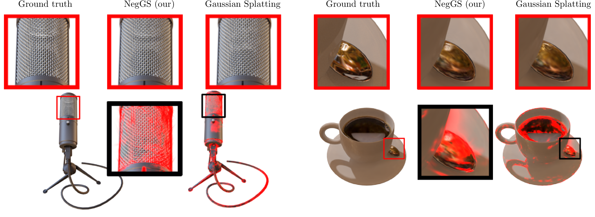

# NegGS: Negative Gaussian Splatting

Artur Kasymov, Bartosz Czekaj, Marcin Mazur, Jacek Tabor, Przemysław Spurek



## Abstract

One of the key advantages of 3D rendering is its ability to simulate intricate scenes accurately. One of the most 
widely used methods for this purpose is Gaussian Splatting, a novel approach that is known for its rapid training and 
inference capabilities. In essence, Gaussian Splatting involves incorporating data about the 3D objects of interest 
into a series of Gaussian distributions, each of which can then be depicted in 3D in a manner analogous to traditional 
meshes. It is regrettable that the use of Gaussians in Gaussian Splatting is currently somewhat restrictive due to 
their perceived linear nature. In practice, 3D objects are often composed of complex curves and highly nonlinear 
structures. This issue can to some extent be alleviated by employing a multitude of Gaussian components to reflect 
the complex, nonlinear structures accurately. However, this approach results in a considerable increase in time 
complexity. This paper introduces the concept of negative Gaussians, which are interpreted as items with negative 
colors. The rationale behind this approach is based on the density distribution created by dividing the probability 
density functions (PDFs) of two Gaussians, which we refer to as Diff-Gaussian. Such a distribution can be used to 
approximate structures such as donut and moon-shaped datasets. Experimental findings indicate that the application of 
these techniques enhances the modeling of high-frequency elements with rapid color transitions. Additionally, 
it improves the representation of shadows. To the best of our knowledge, this is the first paper to extend the simple 
elipsoid shapes of Gaussian Splatting to more complex nonlinear structures.

## Update

* [May 2024] Repository creation. The source code will be available soon!


## Citation
```


```